```{r setup, include=FALSE, fig.align='center'}
knitr::opts_chunk$set(message = F, warning = F)
```


```{r include=FALSE}
data <- read.csv("train.csv")
library(dplyr)
library(ggplot2)
library(corrplot)
library(printr)
```


In this section we will try to determine if there are significant relationships between our target variable --- Loan_Status --- and the independent variables. The table below is a summary of our objectives.

|Hypothesis No.|Description|
|:--- |:--- |
|Hypothesis No. 1|Males are more likely to be eligible than females|
|Hypothesis No. 2|A married applicant is more likely to be eligible for a house loan|
|Hypothesis No. 3|An applicant with no dependents is more likely to be eligible for a house loan|
|Hypothesis No. 4|Graduates are more likely to be eligible for a house loan|
|Hypothesis No. 5|Self-employed are less likely to be eligible for a house loan|
|Hypothesis No. 6|Applicants who apply for less loan amount are more likely to be eligible|
|Hypothesis No. 7|Applicants who earn more are more likely to be eligible|
|Hypothesis No. 8|Coapplicants who earn more are more likely to be eligible|
|Hypothesis No. 9|Applicants who can pay sooner are more eligible|
|Hypothesis No. 10|Applicants who met the credit history guidelines are more likely to be eligible for a house loan|
|Hypothesis No. 11|Applicants who apply for Semiurban area are more likely to be eligible for a house loan|

Let us proceed by testing hypothesis number 1.   

### **1. Males are more likely to be eligible than females**

>Ho: There is no significant relationship between gender and loan status.  
>Ha: There is a significant relationship between gender and loan status.

<center>

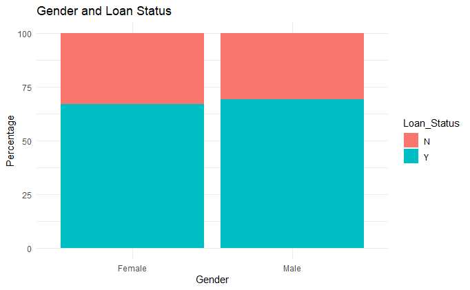

</center>

```{r, echo=F, message=FALSE}
data %>% 
  filter(Gender != "") %>% 
  group_by(Gender, Loan_Status) %>% 
  summarise(Count=n()) %>% 
  mutate(Percentage=paste(round(Count*100/sum(Count),1),"%"))

```
We can see from the graph and the table that male applicants have a slightly higher loan eligibility rate. We will check if this difference is statistically significant.

Gender and Loan_Status are both categorical variables. A suitable statistical test would be a chi-square test using the `chisq.test()` function in r.

```{r}
chisq.test(table(data[data$Gender != "",]$Gender,
                           data[data$Gender != "",]$Loan_Status), 
                     correct = F)
```
**Conclusion:**  
Since the `p-value = 0.6264` is greater than our chosen significance level (alpha = 0.05), we **do not reject** the null hypothesis. Rather, we conclude that there is not enough evidence to suggest a relationship between gender and loan eligibility.

### **2. A married applicant is more likely to be eligible for a house loan**

>Ho: There is no significant relationship between civil status and eligibility.  
>Ha: There is a significant relationship between civil status and eligibility.  

<center>

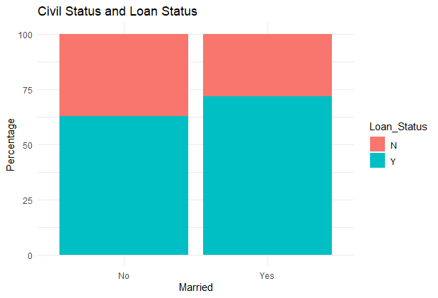

</center>

```{r, echo=F, message=FALSE}
data %>% 
  filter(Married != "") %>% 
  group_by(Married, Loan_Status) %>% 
  summarise(Count=n()) %>% 
  mutate(Percentage=paste(round(Count*100/sum(Count),1),"%"))

```

It is clear that married applicants are more likely to get loan approval; however, this might have occurred by chance so we proceed with the hypothesis testing.

Just like the previous hypothesis, both variables are categorical.

```{r}
married <- chisq.test(table(data[data$Married != "",]$Married,
                            data[data$Married != "",]$Loan_Status),
           correct = F)
married
```
**Conclusion:**  
Since the `p-value = 0.02732` is less than our chosen significance level (alpha = 0.05), we can **reject the null hypothesis**, and conclude that there is a relationship between applicant civil status and loan eligibility.

We can further examine the relationship by plotting the residuals using the `corrplot()` function. The visualization will display the residuals in blue and red gradient of colors. A positive residual will be assigned to a certain shade of blue. The shade will depend on the value of residuals. The same scheme will be applied on the negative residuals except that the color that will be used is red.

A positive residual means an attraction (positive association) between the corresponding row and column variables, while a negative residual implies a repulsion (negative association) between the corresponding row and column variables

```{r ,fig.align='center'}
corrplot(married$residuals,is.corr = F,
         title = "Association between Civil Status and Loan Status",
         mar=c(0,0,2,0),tl.srt=0)
```

**Interpretation: **  
1. Unmarried applicants are *strongly associated* with loan ineligibility.  
2. Married applicants are *associated* with loan eligibility.  


  
### **3. An applicant with no dependents is more likely to be eligible for a house loan**

>Ho: There is no significant relationship between number of dependents and eligibility.  
>Ha: There is a significant relationship between number of dependents and eligibility.

<center>

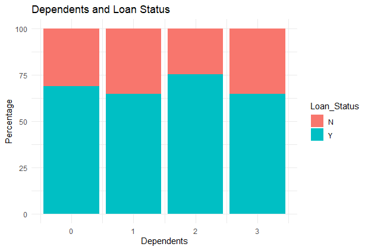

</center>

```{r, echo=F, message=FALSE}
data %>% 
  filter(Dependents != "") %>% 
  group_by(Dependents, Loan_Status) %>% 
  summarise(Count=n()) %>% 
  mutate(Percentage=paste(round(Count*100/sum(Count),1),"%"))

```

We can see that the rate of eligibility across the number of dependents are varying. Let's find out if these differences are significant.

```{r}
chisq.test(table(data[data$Dependents != "",]$Dependents,
                               data[data$Dependents != "",]$Loan_Status),
           correct = F)
```

**Conclusion:**  
Since the `p-value = 0.3679` is greater than our chosen significance level, we **do not reject** the null hypothesis. Rather, we conclude that there is not enough evidence to suggest a relationship between number of dependents and loan eligibility.

### **4. Graduates are more likely to be eligible for a house loan.**  
>Ho: There is no significant relationship between education and eligibility.  
>Ha: There is a significant relationship between education and eligibility.

<center>

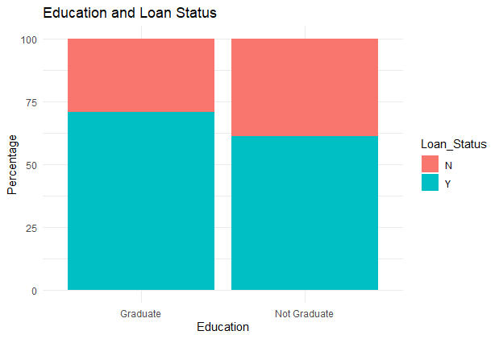  

</center>

```{r echo=F, message=FALSE}
data %>% 
  group_by(Education, Loan_Status) %>% 
  summarise(Count=n()) %>% 
  mutate(Percentage=paste(round(Count*100/sum(Count),1),"%"))

```

We see that applicants who graduated have higher eligibility rate. Let us test this difference.

```{r}
education <- chisq.test(table(data$Education,
                              data$Loan_Status),
                        correct = F)
education
```
**Conclusion:**  
Since the `p-value = 0.03333` is less than our chosen significance level, we can **reject the null hypothesis**, and conclude that there is a relationship between applicant civil status and loan eligibility.

Let us visualize the residuals to zoom in on the dependencies between the categories.
```{r, fig.align='center'}
corrplot(education$residuals,is.corr = F,
         title = "Association between Education and Loan Status",
         mar=c(0,0,2,0),tl.srt=0)

```

**Interpretation:**  
1. Applicant who did not graduate is *strongly associated* with loan ineligibility.  
2. Applicant who graduated is *associated* with loan eligibility.  

### **5. Self-employed are less likely to be eligible for a house loan**  
>Ho: There is no significant relationship between employment type and eligibility.  
>Ha: There is a significant relationship between employment type and eligibility.  

<center>

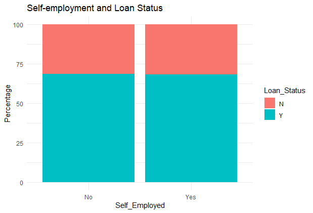

</center>

```{r echo=F, message=FALSE}
data %>% 
  filter(Self_Employed != "") %>% 
  group_by(Self_Employed, Loan_Status) %>% 
  summarise(Count=n()) %>% 
  mutate(Percentage=paste(round(Count*100/sum(Count),1),"%"))

```

The bar graph shows that the loan eligibility rate for both self-employed and not self-employed applicants are approximately the same. Nevertheless, let us examine this.

```{r}
chisq.test(table(data[data$Self_Employed != "",]$Self_Employed,
                 data[data$Self_Employed != "",]$Loan_Status),
           correct = F)
```

**Conclusion:**  
Since the `p-value = 0.9557` is greater than our chosen significance level, we **do not reject** the null hypothesis. Rather, we conclude that there is not enough evidence to suggest a relationship between number of dependents and loan eligibility.


### **6. Applicants who apply for less loan amount are more likely to be eligible.**  
>Ho: There is no significant relationship between loan amount and eligibility.  
>Ha: There is a significant relationship between loan amount and eligibility.  

<center>

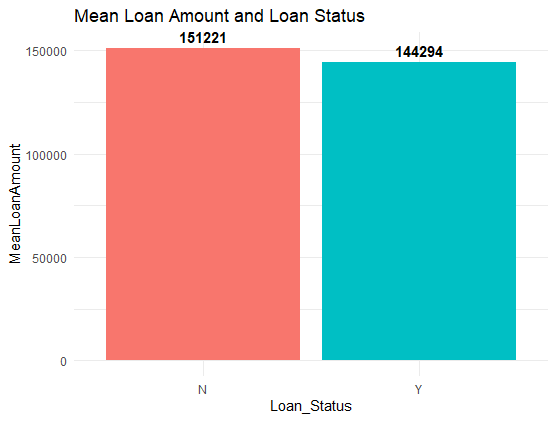  

</center>

```{r echo=F, message=FALSE}
data %>% 
  filter(LoanAmount != "") %>% 
  group_by(Loan_Status) %>% 
  summarise(Count = n(), 
            MeanLoanAmount=round(mean(LoanAmount*1000),0))
```

Let us check the equality of variance between those with approved and disapproved loan status.  First, I'll add a column containing the log of loan amount.  

```{r}
var.test(data[data$Loan_Status=="Y",]$LoanAmount,
         data[data$Loan_Status=="N",]$LoanAmount)$p.value
```
The test of variance equality returned a p-value greater than alpha = 0.05; therefore, there is no significant difference in variance between the groups. This information will be useful in the `t.test` that will follow.  
```{r}
t.test(data[data$Loan_Status=="Y",]$LoanAmount,
       data[data$Loan_Status=="N",]$LoanAmount,
       alt="two.sided",var.equal = T,paired = F)

```
Since the `p-value = 0.3647` is greater than our chosen significance level (alpha = 0.05), we **do not reject** the null hypothesis. Rather, we conclude that there is not enough evidence to suggest a relationship between loan amount and loan eligibility.  


### **7. Applicants who earn more are more likely to be eligible.**  
>Ho: There is no significant relationship between applicant income and eligibility.  
>Ha: There is a significant relationship between applicant income and eligibility.  

<center>

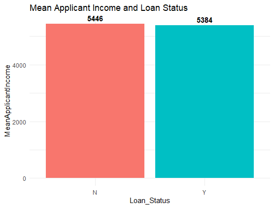

</center>

```{r echo=F, message=FALSE}
data %>% 
  group_by(Loan_Status) %>% 
  summarise(Count = n(),
            MeanApplicantIncome = mean(ApplicantIncome) %>% round(2))
```

Log transformation is not required and we can use `t.test` in this case because the sample size is big enough.  

First, the variance between the two groups will be measured and the result will be used in the `t.test()`.

```{r}
var.test(data[data$Loan_Status=="Y",]$ApplicantIncome,
         data[data$Loan_Status=="N",]$ApplicantIncome)$p.value

t.test(data[data$Loan_Status=="Y",]$ApplicantIncome,
       data[data$Loan_Status=="N",]$ApplicantIncome,
       alt="two.sided",var.equal = F,paired = F)

```

Since the `p-value = 0.9129` is greater than our chosen significance level, we **do not reject** the null hypothesis. Rather, we conclude that there is not enough evidence to suggest a relationship between applicant income and loan eligibility.

### **8. Applicants with higher co-applicant income are more likely to be eligible.**  

>Ho: There is no significant relationship between co-applicant income and eligibility.  
>Ha: There is a significant relationship between co-applicant income and eligibility.  

<center>

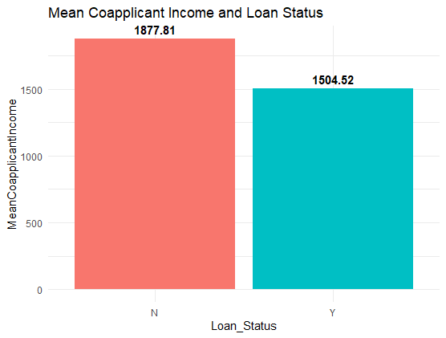

</center>

```{r message=F}
data %>% 
  group_by(Loan_Status) %>% 
  summarise(Count = n(),
            MeanCoapplicantIncome = mean(CoapplicantIncome) %>% round(2))
```

Log transformation is not required and we can use `t.test` in this case because the sample size is big enough.  

First, the variance between the two groups will be measured and the result will be used in the `t.test()`.

```{r}
var.test(data[data$Loan_Status=="Y",]$CoapplicantIncome,
         data[data$Loan_Status=="N",]$CoapplicantIncome)$p.value

t.test(data[data$Loan_Status=="Y",]$CoapplicantIncome,
       data[data$Loan_Status=="N",]$CoapplicantIncome,
       alt="two.sided",var.equal = F,paired = F)

```

Since the `p-value = 0.2591` is greater than our chosen significance level, we do not reject the null hypothesis. Rather, we conclude that there is not enough evidence to suggest a relationship between co-applicant income and loan eligibility.  
  
  
  
### **9. Applicants who can pay sooner are more eligible.**  
>Ho: There is no significant relationship between Loan_Amount_Term and eligibility.  
>Ha: There is a significant relationship between Loan_Amount_Term and eligibility.  

<center>

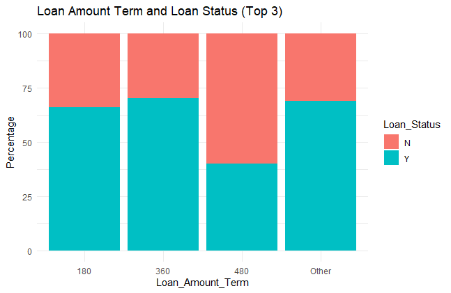  

</center>

```{r message=FALSE}
data %>% 
  filter(Loan_Amount_Term != "") %>% 
  mutate(Loan_Amount_Term = factor(Loan_Amount_Term),
         Loan_Amount_Term = forcats::fct_lump(Loan_Amount_Term, n = 3)) %>% 
  group_by(Loan_Amount_Term,Loan_Status) %>% 
  summarise(Count=n()) %>% 
  mutate(Percentage  = paste(round(Count*100/sum(Count),1),"%"))
```

Classify loan amount terms below top three with highest count as "Other".  
```{r}
x <- ifelse(data$Loan_Amount_Term %in% c(360, 180, 480, NA), data$Loan_Amount_Term, "Other")

datax <- data
datax$Loan_Amount_Term <- x

table(datax$Loan_Amount_Term, datax$Loan_Status)
```

Perform chi-square test:  
```{r warning=FALSE}
chisq.test(table(datax$Loan_Amount_Term, datax$Loan_Status))
```

Since the `p-value = 0.09398` is greater than our chosen significance level, we **do not reject** the null hypothesis. Rather, we conclude that there is not enough evidence to suggest a relationship between loan amount term and loan eligibility.  

### **10. Applicants who met the credit history guidelines are more likely to be eligible for a house loan.**  
>Ho: There is no significant relationship between credit history and eligibility.  
>Ha: There is a significant relationship between credit history and eligibility.  

<center>

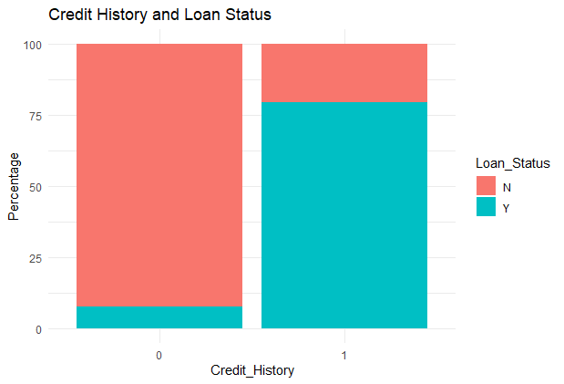

</center>


```{r echo=F, message=FALSE}
data %>% 
  filter(Credit_History != "") %>% 
  group_by(Credit_History,Loan_Status) %>% 
  summarise(Count=n()) %>% 
  mutate(Percentage  = paste(round(Count*100/sum(Count),1),"%"))
```

There is an obvious imbalance in the eligibility rate between applicants with credit history and those without.

```{r}
credit <- chisq.test(table(data$Credit_History,
                           data$Loan_Status),
                     correct = F)
credit
credit$p.value

```
**Conclusion:**  
Since the `p-value = 1.370732e-40` is less than our chosen significance level, we can **reject the null hypothesis**, and conclude that there is a relationship between applicant civil status and loan eligibility.  

Again, let us visualize the residuals.

```{r, fig.align='center'}
corrplot(credit$residuals,is.corr = F,
         title = "Association between Credit History and Loan Status",
         mar=c(0,0,2,0),tl.srt=0)

```

**Interpretation:**  
1. Having no credit history is *strongly associated* with loan ineligibility.  
2. Having credit history is *associated* with loan eligibility.  


### **11. Applicants who apply for Semiurban area are more likely to be eligible for a house loan.**  

>Ho: There is no significant relationship between property area and eligibility.  
>Ha: There is a significant relationship between property area and eligibility.  

<center>

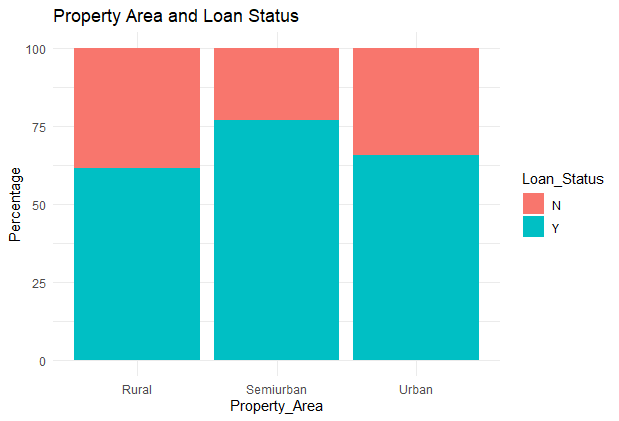

</center>

```{r echo=F, message=FALSE}
data %>% 
  group_by(Property_Area,Loan_Status) %>% 
  summarise(Count=n()) %>% 
  mutate(Percentage  = paste(round(Count*100/sum(Count),1),"%"))
```

We can see that the semi-urban property area has the highest loan approval rate.

```{r}
property <- chisq.test(table(data$Property_Area,
                             data$Loan_Status),correct = F)
property
```

Since the `p-value = 0.002136` is less than our chosen significance level, we can `reject the null hypothesis`, and conclude that there is a relationship between applicant civil status and loan eligibility.

```{r, fig.align='center'}
corrplot(property$residuals,is.corr = F,
         title = "Association between Property Area and Loan Status",
         mar=c(0,0,2,0),tl.srt=0)
```

**Interpretation:**  
1. Rural property area is very strongly associated with loan ineligibility.  
2. Semi urban property area is strongly associated with loan eligibility.  
3. Urban property area is associated with loan ineligibility.  

### Summary:

1.	Credit History  
*	Applicants who passed the guidelines for credit history are more likely to get loan approval.  
2.	Property Area  
*	House loan applications in Semi-urban property areas, followed by Urban property areas are more likely to get loan approval. One assumption for this could be that properties in these areas may increase in value over time at a faster rate than those in rural areas.
3.	Civil Status  
*	Married applicants are more likely to get loan approval, as a partner may help in paying off the loan.   
4.	Educational Background  
*	Applicants who graduated are more likely to get loan approval.  

